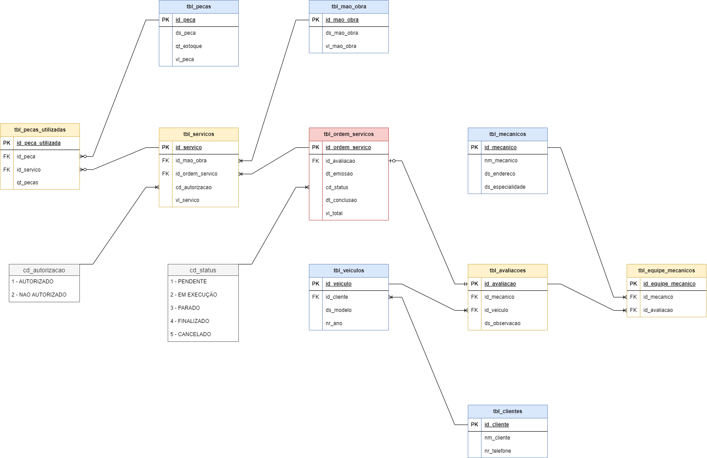

### 🔧 PROJETO OFICINA — Narrativa

---

### 🧩 Contexto

- Sistema de controle e gerenciamento de **ordens de serviço (OS)** em uma oficina mecânica.  
- **Clientes** levam veículos para conserto ou revisão periódica.  
- Cada **veículo** é avaliado por uma **equipe de mecânicos**, que identifica os serviços e preenche a OS com a **data de emissão e previsão de conclusão**.  
- Cada **serviço** tem um valor calculado com base na **tabela de mão de obra**.  
- Cada **peça** utilizada também contribui para o valor total da OS.  
- O **cliente** deve autorizar a execução dos serviços.  
- A **mesma equipe de mecânicos** avalia e executa os serviços.  
- Cada **mecânico** possui: código, nome, endereço e especialidade.  
- Cada **OS** contém: número, data de emissão, valor total, status e data de conclusão.  
- Uma **OS** pode conter **vários serviços**, mas cada serviço pertence a apenas **uma OS**.  
- Uma **OS** pode conter **vários tipos de peças**, e uma mesma peça pode ser utilizada em **mais de uma OS**.

---

### 📝 Observação

O **Modelo Entidade-Relacionamento (MER)** foi desenvolvido a partir desta narrativa:  

---

### 📊 Respostas obtidas com Queries

1. **Query: Listar clientes e veículos**
2. **Query: Serviços autorizados com valor total > 100**
3. **Query: Serviços autorizados com valor total > 200**
4. **Query: Total gasto por cliente**